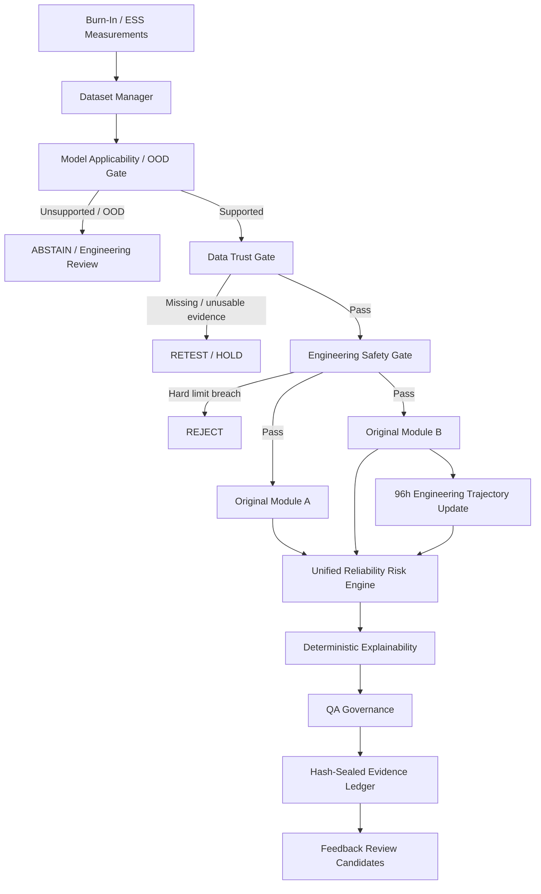
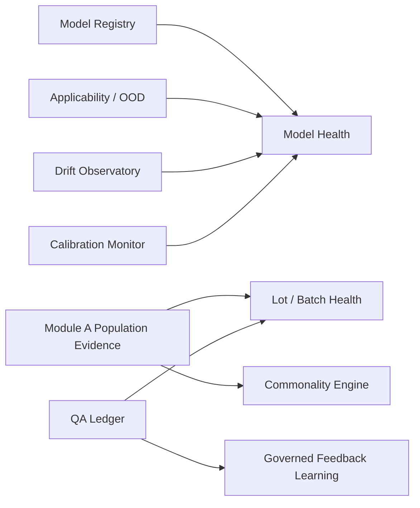

# SPARK S.P.A.R.K. — Smart Predictive Anomaly & Reliability Knowledgebase
Transforming Burn-In Data into Actionable Reliability Intelligence


Smart → hybrid engineering + AI decision support
Predictive → 168h forecasting from early burn-in checkpoints
Anomaly → dynamic outlier and lot-aware detection
Reliability → the core purpose of the system
Knowledgebase → traceability, evidence, QA decisions, model/lot history

https://spark-engineering-quality-intelligence.onrender.com/

(The application might take up to 1min open due to inactivity)

> **S.P.A.R.K. — Transforming Burn-In Data into Actionable Reliability Intelligence**
> Smart India Hackathon 2026 · Problem Statement 26170 · Team VIKRITI
> Problem: **AI-Driven Anomaly Detection in Component Burn-In & Screening**
> Organization: **Indian Space Research Organisation (ISRO), Department of Space**

SPARK is an engineering decision-support platform for **high-reliability electronic component burn-in and screening**. It combines deterministic engineering safeguards, lot-aware anomaly detection, 168-hour leakage forecasting, model applicability checks, drift and calibration monitoring, population-level lot intelligence, explainable QA decisions, human override governance, and tamper-evident local traceability.

SPARK is designed for the exact failure mode that static pass/fail screening can miss: a component can remain inside a datasheet limit yet still behave abnormally relative to its lot, historical population, or degradation trajectory.

The current implementation is **Version 9.0.0** and preserves the validated original Phase-1 Module-A and Module-B artifacts rather than fabricating replacement ML outputs.

---

## Contents

1. [Problem and motivation](#1-problem-and-motivation)
2. [What SPARK does](#2-what-spark-does)
3. [System principles](#3-system-principles)
4. [End-to-end architecture](#4-end-to-end-architecture)
5. [Decision path](#5-decision-path)
6. [Dataset and schema contract](#6-dataset-and-schema-contract)
7. [Module A — dynamic anomaly detection](#7-module-a--dynamic-anomaly-detection)
8. [Module B — 168h drift forecast](#8-module-b--168h-drift-forecast)
9. [Data Trust Gate](#9-data-trust-gate)
10. [Engineering Safety Gate](#10-engineering-safety-gate)
11. [Model Applicability / OOD Gate](#11-model-applicability--ood-gate)
12. [Rolling 24h → 96h → 168h update](#12-rolling-24h--96h--168h-update)
13. [Unified Reliability Risk Engine](#13-unified-reliability-risk-engine)
14. [Deterministic explainability](#14-deterministic-explainability)
15. [QA governance](#15-qa-governance)
16. [Traceability ledger](#16-traceability-ledger)
17. [Model registry](#17-model-registry)
18. [Drift Observatory](#18-drift-observatory)
19. [Calibration Monitor](#19-calibration-monitor)
20. [Lot and batch intelligence](#20-lot-and-batch-intelligence)
21. [Commonality Engine](#21-commonality-engine)
22. [Governed feedback learning](#22-governed-feedback-learning)
23. [UI workflow](#23-ui-workflow)
24. [API reference](#24-api-reference)
25. [Repository structure](#25-repository-structure)
26. [Installation](#26-installation)
27. [Running locally](#27-running-locally)
28. [Testing](#28-testing)
29. [Current validated reference metadata](#29-current-validated-reference-metadata)
30. [Important engineering semantics](#30-important-engineering-semantics)
31. [Known limitations](#31-known-limitations)
32. [Deployment considerations](#32-deployment-considerations)
33. [Research and industry context](#33-research-and-industry-context)
34. [Demo flow](#34-demo-flow)
35. [Roadmap](#35-roadmap)

---

# 1. Problem and motivation

High-reliability sectors such as space, aerospace, automotive safety, medical systems, industrial control, defence, and power electronics use environmental stress screening and burn-in to expose latent defects before field deployment.

Traditional screening commonly starts with static specification limits:

```text
Measurement <= datasheet maximum  -> PASS
Measurement >  datasheet maximum  -> FAIL
```

That is necessary, but it is not always sufficient.

Example:

```text
Datasheet leakage maximum = 50 µA
Lot average                = 10 µA
Component A                = 10 µA  -> expected
Component B                = 45 µA  -> technically inside the limit
```

A purely static system may pass Component B. A reliability engineer, however, may reasonably ask why that device is behaving very differently from the rest of its population.

SIH26170 therefore calls for two complementary capabilities:

- **Module A — dynamic outlier detection:** identify abnormal components relative to lot/population behavior, not only absolute limits.
- **Module B — drift prediction:** use early burn-in measurements such as 0h and 24h to forecast later behavior such as 168h.

SPARK extends those two core modules with trustworthy decision infrastructure around them.

---

# 2. What SPARK does

SPARK currently provides these implemented capability groups.

| Layer | Capability | Purpose |
|---|---|---|
| Data | Dataset Manager | Upload, activate, inspect, and compare CSV/Excel datasets |
| Trust | Data Trust Gate | Verify early evidence quality before using it for screening |
| Safety | Engineering Safety Gate | Enforce non-negotiable electrical limits |
| Applicability | Model Applicability / OOD Gate | Decide whether Module-B evidence should be trusted for the current component |
| ML | Module A | Lot-aware / historical dynamic anomaly evidence |
| ML | Module B | 168h leakage forecast from early evidence |
| Update | Rolling 96h Engineering Update | Reassess trajectory when 96h observation becomes available |
| Fusion | Reliability Risk Engine | Combine trustworthy evidence into a deterministic QA recommendation |
| Explanation | Reason-Code Engine | Explain why the recommendation was generated |
| Human review | QA Governance | Control agreement, notes, overrides, and mandatory override justification |
| Traceability | Hash-Sealed QA Ledger | Persist assessment and human decisions with local integrity checks |
| Lifecycle | Model Registry | Track schema/model contracts and artifact hashes |
| Monitoring | Drift Observatory | Compare current population behavior with reference data |
| Monitoring | Calibration Monitor | Check prediction interval coverage using evaluation truth |
| Population | Lot / Batch Health | Summarize escalation and anomaly behavior by lot and batch |
| Population | Commonality Engine | Identify attributes enriched among risky components |
| Learning governance | Feedback Learning | Convert governed QA disagreement history into offline review candidates |

---

# 3. System principles

SPARK is intentionally built around a few hard rules.

### 3.1 Engineering safety outranks ML

A measured hard electrical limit failure cannot be softened into an ACCEPT decision by an anomaly model or forecast.

### 3.2 Bad data cannot become a confident decision

Missing 0h/24h evidence, unusable measurements, or incompatible conditions must result in RETEST/HOLD rather than silent model execution.

### 3.3 A model must be applicable before it is trusted

The presence of a `.joblib` artifact is not enough. SPARK checks schema, checkpoints, and robust population similarity before authorizing Module-B evidence.

### 3.4 Model output is evidence, not authority

SPARK produces a machine recommendation. Final disposition remains a governed QA action.

### 3.5 No silent self-learning

QA feedback can create review candidates, but SPARK does **not** automatically retrain models, change thresholds, recalibrate production behavior, or promote a new artifact.

### 3.6 Traceability must survive model evolution

Dataset, schema, feature-set, model, validation, inference, explanation, human decision, and ledger evidence are kept conceptually separate.

---

# 4. End-to-end architecture



The population-intelligence layer surrounds the component-level decision path:



---

# 5. Decision path

The component-level decision path is deterministic in its guardrail precedence.

```text
1. Model applicability
2. Data Trust
3. Engineering Safety
4. Module A dynamic anomaly evidence
5. Module B forecast evidence
6. Reliability Risk Engine
7. Explainability
8. Human QA governance
9. Traceability ledger
```

A simplified precedence view:

```text
SCHEMA / OOD FAILURE
    -> ABSTAIN / REVIEW

MISSING OR UNUSABLE EARLY EVIDENCE
    -> RETEST / HOLD

OBSERVED HARD ELECTRICAL FAILURE
    -> REJECT

MODULE A ABNORMALITY
    -> WATCH / HOLD / RETEST / REJECT as applicable

MODULE B CONSERVATIVE FORECAST REACHES LIMIT
    -> HOLD

GUARDRAILS PASS + NO MATERIAL ESCALATION
    -> ACCEPT
```

---

# 6. Dataset and schema contract

The reference burn-in dataset is long-form: one component can have several measurement rows at different burn-in times.

Current checkpoints:

```text
0h
24h
96h
168h
```

The current clean long-form reference dataset uses fields including:

```text
measurement_id
component_id
lot_id
burnin_batch_id
dataset_split
part_number
qualification_level
parameter_name
measurement_time_h
leakage_current_uA
nominal_temperature_c
recorded_temperature_c
reverse_voltage_v
stress_temperature_c
stress_reverse_bias_v
datasheet_upper_limit_uA
instrument_id
raw_row_count
duplicate_count
source_quality_issues
quality_status
cleaning_actions
missing_value_flag
condition_mismatch_flag
usable_for_ml
```

At minimum, Phase 8's base schema contract requires:

```text
component_id
measurement_time_h
leakage_current_uA
```

The schema registry computes a SHA-256 fingerprint from sorted column names and pandas dtypes. This fingerprint identifies the **schema contract**, not the dataset contents.

### Schema evolution policy

SPARK does **not** automatically treat every new column as an ML feature.

The intended evolution path is:

```text
New parameter
    ↓
Schema validation
    ↓
Engineering relevance
    ↓
Data quality / missingness
    ↓
Availability at prediction time
    ↓
Leakage check
    ↓
Candidate feature engineering
    ↓
Cross-validation / robustness
    ↓
Baseline-vs-candidate comparison
    ↓
Engineering review
    ↓
New versioned feature set / model
```

This preserves reproducibility and prevents silent feature drift.

---

# 7. Module A — dynamic anomaly detection

SPARK loads the **original Phase-1 Module-A artifact and scoring implementation**.

Artifact:

```text
artifacts/models/module_a_24h.joblib
```

Artifact contract:

```python
{"model": model, "metadata": model_metadata(model)}
```

Current metadata identifies the algorithm as:

```text
Lot MAD
+ historical baseline
+ batch early-slope behavior
+ Isolation Forest
```

The 24-hour feature set includes early electrical behavior, within-lot robust statistics, historical robust statistics, lot shift, quality evidence, and missing/condition information.

Representative Module-A evidence exposed by SPARK:

```text
ir_0h_uA
ir_24h_uA
within_lot_risk_score
historical_risk_score
lot_shift_risk_score
batch_median_slope_0_24
batch_slope_shift_score
isolation_forest_raw_score
isolation_forest_is_outlier
static_limit_failed_at_24h
module_a_action
module_a_primary_reason
```

Current Module-A action vocabulary includes:

```text
ACCEPT
WATCH
HOLD_FOR_REVIEW
RETEST
REJECT
```

The current reference Module-A metadata records:

```text
time_cutoff_h = 24
uses_ground_truth_labels = False
```

SPARK therefore keeps the early anomaly screen time-safe through 24h.

---

# 8. Module B — 168h drift forecast

SPARK also loads the **original Phase-1 Module-B trained pipeline**.

Artifact:

```text
artifacts/models/module_b_24h.joblib
```

Artifact contract:

```python
{"bundle": bundle, "metadata": metadata}
```

Current reference metadata:

```text
Prediction time: 24h
Forecast target: 168h leakage
Target field: ir_168h_uA
Selected model: median_ensemble
Quantiles: 0.05, 0.50, 0.95
Safety residual quantile: 0.995
Uses 96h or 168h as input: False
Uses hidden truth labels: False
```

The current reference ensemble uses:

```text
linear_extrapolation
Huber regression
Histogram Gradient Boosting
```

and keeps Extra Trees as a benchmark candidate in artifact metadata.

SPARK exposes:

```text
predicted_ir_168h_uA
prediction_lower_05_uA
prediction_median_50_uA
prediction_upper_95_uA
prediction_interval_width_uA
predicted_slope_24_168_uA_per_h
safety_margin_uA
conformal_safety_upper_uA
```

When evaluation data contains 168h truth, SPARK may also display:

```text
actual_ir_168h_uA
absolute_prediction_error_uA
```

Those fields are explicitly **evaluation-only** and are not used as 24h inference inputs.

---

# 9. Data Trust Gate

`core/gates.py` evaluates whether early evidence is suitable for screening.

Checks can include:

- presence of 0h and 24h checkpoints;
- at least two finite early leakage values;
- `usable_for_ml` status;
- missing-value flags;
- condition comparability;
- `quality_status`.

The displayed Data Trust score is simply:

```text
passed applicable checks / total applicable checks × 100
```

It is **not ML confidence** and it is **not component reliability probability**.

Typical outputs:

```text
PASS      -> CONTINUE
HOLD      -> review non-critical quality issue
RETEST    -> required evidence is missing or unusable
```

---

# 10. Engineering Safety Gate

The Engineering Safety Gate is independent of Module A and Module B.

For early measurements through 24h it compares:

```text
leakage_current_uA
vs
datasheet_upper_limit_uA
```

Behavior:

```text
Observed value <= documented limit
    -> PASS / CONTINUE

Observed value > documented limit
    -> FAIL / REJECT

Engineering-limit evidence unavailable
    -> UNAVAILABLE / HOLD
```

ML evidence can never override a hard observed failure.

---

# 11. Model Applicability / OOD Gate

`core/applicability.py` answers a different question from prediction:

> **Should the current Module-B model be trusted for this component at all?**

The gate checks:

- required schema fields;
- required 0h/24h checkpoints;
- early finite values;
- similarity to a training/reference population using robust median/MAD distance.

Current states:

```text
SUPPORTED
SUPPORTED_WITH_CAUTION
OUT_OF_DOMAIN
SCHEMA_INCOMPATIBLE
INSUFFICIENT_EVIDENCE
MODEL_NOT_APPLICABLE
```

Default robust-distance thresholds:

```text
caution = 4.0 robust sigma
abstain = 6.0 robust sigma
```

The gate exposes:

```text
checkpoint_values_uA
population_similarity
robust_distance_by_checkpoint
max_robust_distance
uses_future_measurements
```

The current early applicability screen explicitly reports:

```text
uses_future_measurements = False
```

When Module-B evidence is not authorized, SPARK can retain diagnostic information internally but prevents that forecast from acting as normal decision-facing evidence.

---

# 12. Rolling 24h → 96h → 168h update

The production trained forecast remains the original 24h Module-B model.

When a real 96h measurement becomes available, SPARK adds a **transparent engineering trajectory update**:

```text
24h observed value
96h observed value
    ↓
observed 24h→96h slope
    ↓
linear engineering projection to 168h
    ↓
compare with original 24h ML forecast
```

Possible trajectory labels:

```text
IMPROVING
STABLE
DETERIORATING
```

Important:

```text
is_trained_96h_ml_model = False
```

SPARK does not falsely represent this engineering projection as a trained 96h model.

If a future `module_b_96h.joblib` artifact is detected, the Model Registry marks it:

```text
DISCOVERED_NOT_ACTIVATED
```

until its training and validation contract is reviewed.

---

# 13. Unified Reliability Risk Engine

`core/risk_engine.py` fuses already-validated evidence into one deterministic machine recommendation.

The returned **Reliability Risk Score (0–100)** is a QA prioritization index.

It is **not** a calibrated probability that the component will fail.

The engine applies guardrail precedence first and only then interprets Module-A/Module-B evidence.

Representative output:

```text
reliability_risk_score
risk_band
evidence_completeness_pct
unified_action
reason
safety_override
forecast_limit_utilization_pct
contributors
score_is_probability = False
```

Risk bands can include:

```text
LOW
ELEVATED
HIGH
CRITICAL
INDETERMINATE
```

If required evidence is inadequate, SPARK can deliberately return:

```text
reliability_risk_score = None
risk_band = INDETERMINATE
```

rather than inventing confidence.

---

# 14. Deterministic explainability

`core/explainability.py` converts existing evidence into ranked reason codes and an auditable decision path.

It is rule-based:

```text
deterministic = True
uses_llm = False
```

Examples:

```text
DT-RETEST-001   Required early evidence incomplete / unusable
ES-FAIL-001     Observed electrical limit breach
MA-WATCH-001    Dynamic anomaly detected
MB-HOLD-001     Conservative forecast reaches engineering limit
```

The explanation layer can return:

```text
recommended_action
primary_reason_code
primary_reason
primary_reason_title
reason_codes[]
decision_path[]
evidence_summary
```

It explains the recommendation; it does not create or alter model evidence.

---

# 15. QA governance

`core/governance.py` controls how a human QA reviewer interacts with the machine recommendation.

Review responses:

```text
AGREE
NOTE
OVERRIDE
```

Rules:

- `AGREE` / `NOTE` cannot silently change the machine recommendation.
- A different final disposition must use `OVERRIDE`.
- Overrides require a controlled reason code.
- Override justification must contain at least 20 characters.
- Hard engineering failures cannot be relaxed below `REJECT` / `QUARANTINE`.
- Data Trust `RETEST` cannot be overridden to `ACCEPT`.

Disagreement classes:

```text
AGREEMENT
CONSERVATIVE_OVERRIDE
RELAXATION_OVERRIDE
PROCESS_DISAGREEMENT
UNCLASSIFIED_DISAGREEMENT
```

Controlled override codes include:

```text
QA-OVR-001  Verified measurement context
QA-OVR-002  Tester or instrument evidence
QA-OVR-003  Verified component history
QA-OVR-004  Approved engineering review
QA-OVR-005  Controlled procedure requirement
QA-OVR-006  Suspected model or threshold limitation
QA-OVR-007  Other controlled exception
```

`QA-OVR-006` specifically raises a model/threshold review flag.

---

# 16. Traceability ledger

`core/qa_manager.py` stores local QA decisions under:

```text
data/qa/<dataset_id>.json
```

New governed records can persist:

```text
component identity
lot / batch context
machine recommendation
human selected action
final action
disagreement class
override reason / justification
Data Trust snapshot
Engineering Safety snapshot
Module-A evidence
Module-B evidence
Model Applicability snapshot
Rolling Forecast snapshot
Risk Engine snapshot
Explanation snapshot
QA comment / timestamp
```

Integrity controls use SHA-256 fields such as:

```text
evidence_fingerprint
prior_ledger_hash
entry_hash
```

The ledger supports verification through:

```text
GET /api/qa/<dataset_id>/integrity
```

This is a **local tamper-evident integrity mechanism**.

It is **not**:

- blockchain;
- a cryptographic digital signature;
- an external timestamp authority;
- an immutable database.

Legacy historical entries remain readable and are explicitly reported as legacy/unsealed rather than rewritten.

---

# 17. Model registry

`core/model_registry.py` builds a read-only model lifecycle view.

Each model entry can include:

```text
module
model_id
status
artifact path
artifact existence
artifact SHA-256
prediction cutoff
required checkpoints
target
feature set
metadata
```

Current model identities:

```text
MODULE-A-24H-v1
MODULE-B-24H-v1
```

Current statuses can include:

```text
PRODUCTION
UNAVAILABLE
DISCOVERED_NOT_ACTIVATED
```

The registry never promotes a discovered artifact automatically.

---

# 18. Drift Observatory

`core/drift.py` compares an active/evaluation population with a reference population.

Current checks include:

- 0h leakage median shift;
- 24h leakage median shift;
- `usable_for_ml` rate shift.

Median shifts use robust median/MAD scaling.

States:

```text
STABLE
WATCH
ALERT
UNAVAILABLE
```

Current implementation semantics:

> Recompute the snapshot whenever data are uploaded/activated; no background streaming monitor is claimed.

This is deliberate. SPARK currently performs on-demand population monitoring rather than pretending to be a continuous Kafka/edge service.

---

# 19. Calibration Monitor

`core/calibration.py` evaluates whether Module-B uncertainty bounds are behaving as expected when 168h evaluation truth is available.

Current checks include:

```text
central 90% interval coverage
one-sided safety-upper coverage
```

Representative output:

```text
expected_pct
observed_pct
gap_percentage_points
state
recalibration_review_required
auto_recalibration = False
```

The monitor may return:

```text
CALIBRATED
WATCH
RECALIBRATION_REVIEW
```

but it never changes production calibration automatically.

---

# 20. Lot and batch intelligence

`core/lot_intelligence.py` aggregates component-level evidence into population-level health views.

For each lot SPARK can report:

```text
component count
health_state
Module-A escalated percentage
Module-A reject percentage
24h robust-z outlier percentage
median 0h leakage
median 24h leakage
median 0→24h slope
action counts
QA decision count
QA override count
QA override rate
```

Lot-health states:

```text
STABLE
ELEVATED
ALERT
```

SPARK also summarizes burn-in batches so engineers can move from individual-device screening to population triage.

The lot-health state is a prioritization signal, not a failure probability.

---

# 21. Commonality Engine

`core/commonality.py` asks:

> What attributes are disproportionately represented among escalated components?

It can compare categorical support between risky and reference populations for fields such as:

```text
lot_id
burnin_batch_id
instrument_id
part_number
qualification_level
```

and can compare numeric medians for features such as:

```text
robust_z_24h
historical_robust_z_24h
slope_0_24_uA_per_h
lot_shift_score_at_24h
```

Representative outputs:

```text
risky_support_pct
reference_support_pct
enrichment_ratio
risky_median
reference_median
median_delta
```

The engine explicitly reports:

```text
causal_claim = False
```

SPARK therefore claims statistical commonality / enrichment, **not causality**.

---

# 22. Governed feedback learning

`core/feedback_learning.py` converts human-review history into an offline engineering review queue.

It can detect patterns such as:

```text
repeated QA-OVR-006 reason codes
repeated WATCH -> HOLD transitions
repeated model/threshold review flags
lot-specific disagreement concentration
```

The resulting candidates may suggest:

```text
MODEL_THRESHOLD_REVIEW
RECURRING_OVERRIDE_REASON
RECURRING_DISAGREEMENT_TRANSITION
```

Hard safeguards:

```text
automatic_retraining = False
automatic_threshold_change = False
```

This is a governed feedback loop, not online learning.

---

# 23. UI workflow

Final navigation:

```text
01  Overview
02  Datasets
03  Process Monitor
04  Analysis
05  Model Health
06  Lot Intelligence
07  QA Inspector
08  Decision History
```

### Overview

High-level active dataset state and key system information.

### Datasets

- list managed datasets;
- upload CSV / Excel;
- activate a dataset;
- preserve original and bundled demo datasets as read-only;
- remove user uploads.

### Process Monitor

Exploratory numeric signal monitoring and control-limit views.

### Analysis

Descriptive statistics, correlations, signal profiles, generic robust evidence, and comparison views.

### Model Health

- model registry;
- schema fingerprint;
- artifact hashes;
- applicability distribution;
- drift snapshot;
- calibration monitoring;
- discovered-but-not-activated 96h artifact visibility.

### Lot Intelligence

- lot health;
- batch health;
- population escalation;
- commonality / enrichment evidence.

### QA Inspector

Per-component review with the full decision chain:

```text
Applicability
→ Data Trust
→ Engineering Safety
→ Reliability Risk
→ Explainability
→ Module A
→ Module B
→ Rolling 96h update
→ Human QA disposition
```

### Decision History

- governed QA ledger;
- integrity status;
- explanation reason codes;
- machine-vs-human disagreement;
- override reason;
- feedback summary;
- feedback-learning review candidates.

---

# 24. API reference

Base local URL:

```text
http://127.0.0.1:5000
```

| Method | Endpoint | Purpose |
|---|---|---|
| GET | `/` | Main dashboard |
| GET | `/api/health` | Service/version/pipeline-root health |
| GET | `/api/datasets` | List managed datasets |
| POST | `/api/datasets/upload` | Upload CSV / Excel |
| POST | `/api/datasets/<dataset_id>/activate` | Activate dataset |
| DELETE | `/api/datasets/<dataset_id>` | Remove user-uploaded dataset and its QA history |
| GET | `/api/datasets/<dataset_id>/analysis` | Dataset analysis payload |
| GET | `/api/datasets/<dataset_id>/model-health` | Registry, applicability, drift, calibration |
| GET | `/api/datasets/<dataset_id>/lot-intelligence` | Lot health + commonality |
| GET | `/api/datasets/<dataset_id>/signals/<column>/control` | Signal control limits |
| GET | `/api/datasets/<dataset_id>/inspection/<index>/assessment` | Component-level full assessment |
| GET | `/api/datasets/<dataset_id>/records/<index>/assessment` | Backward-compatible assessment route |
| GET | `/api/datasets/<dataset_id>/comparison` | Dataset comparison payload |
| GET | `/api/qa/<dataset_id>` | QA decision history |
| POST | `/api/qa/<dataset_id>` | Save governed QA decision |
| GET | `/api/qa/<dataset_id>/integrity` | Verify local ledger integrity |
| GET | `/api/qa/<dataset_id>/feedback-summary` | Aggregate QA governance statistics |
| GET | `/api/qa/<dataset_id>/feedback-learning` | Offline review candidates |
| GET | `/api/pipeline/status` | Original Module-A / Module-B status |

---

# 25. Repository structure

```text
SPARK_GITHUB/
│
├── app.py
├── README.md
├── DEMO_CHECKLIST.md
├── FIX_MANIFEST.txt
├── requirements.txt
├── run_phase7.bat
│
├── core/
│   ├── analysis_engine.py
│   ├── applicability.py
│   ├── calibration.py
│   ├── commonality.py
│   ├── config.py
│   ├── dataset_manager.py
│   ├── drift.py
│   ├── explainability.py
│   ├── feedback_learning.py
│   ├── gates.py
│   ├── governance.py
│   ├── inspection.py
│   ├── lot_intelligence.py
│   ├── model_registry.py
│   ├── pipeline_adapter.py
│   ├── qa_manager.py
│   ├── risk_engine.py
│   └── rolling_forecast.py
│
├── samples/
│   └── spark_igbt_demo_dataset.csv
│
├── static/
│   ├── css/style.css
│   ├── js/app.js
│   └── vendor/plotly.min.js
│
├── templates/
│   └── index.html
│
├── tests/
│   ├── test_explainability.py
│   ├── test_gates.py
│   ├── test_governance.py
│   ├── test_phase6.py
│   ├── test_phase7.py
│   ├── test_phase8.py
│   ├── test_phase9.py
│   ├── test_risk_engine.py
│   └── test_traceability.py
│
└── data/                     # runtime state; not source-of-truth training data
    ├── registry.json
    └── qa/
```

The original trained ML artifacts and source package currently live in the external Phase-1 project referenced by `SPARK_PIPELINE_ROOT` or auto-detection.

---

# 26. Installation

Tested Windows workflow:

```bat
cd /d C:\path\to\SPARK_GITHUB
py -3.13 -m venv .venv
call .venv\Scripts\activate.bat
python -m pip install --upgrade pip
python -m pip install -r requirements.txt
```

Dependencies:

```text
Flask>=3.1,<4
pandas>=2.2,<3
numpy>=2.0,<3
openpyxl>=3.1,<4
xlrd>=2.0,<3
joblib>=1.4,<2
scikit-learn==1.9.0
pytest>=8,<10
```

The exact scikit-learn pin matters because the current Phase-1 serialized artifacts were created with scikit-learn 1.9.0.

---

# 27. Running locally

Activate the environment:

```bat
call .venv\Scripts\activate.bat
```

If Phase-1 is not in one of the historical auto-detected locations:

```bat
set SPARK_PIPELINE_ROOT=C:\path\to\sih26170_prototype
```

Optional host/port:

```bat
set SPARK_HOST=127.0.0.1
set SPARK_PORT=5000
```

Start:

```bat
python app.py
```

Open:

```text
http://127.0.0.1:5000
```

Pipeline status:

```bat
python -c "from core.config import load_settings; from core.pipeline_adapter import PipelineAdapter; import pprint; pprint.pp(PipelineAdapter(load_settings().pipeline_root).status())"
```

Healthy dual-model integration should report:

```text
module_a_available = True
module_b_available = True
prediction_available = True
selected_model = median_ensemble
```

---

# 28. Testing

Compile Python:

```bat
python -m compileall -q app.py core tests
```

Validate browser JavaScript syntax:

```bat
node --check static\js\app.js
```

Run complete regression:

```bat
python -m pytest -q
```

Current Windows validation snapshot for Version 9.0.0:

```text
57 passed
0 failed
```

The suite covers, among other things:

- Data Trust behavior;
- hard electrical safety precedence;
- Module-A and Module-B adapter behavior;
- risk-engine precedence;
- deterministic explanation codes;
- QA governance and override validation;
- ledger integrity;
- schema fingerprints and model registry;
- applicability / OOD abstention;
- drift snapshots;
- 96h trajectory update;
- lot-health escalation;
- commonality behavior;
- interval calibration monitoring;
- governed feedback-learning candidates.

---

# 29. Current validated reference metadata

These values describe the current reference artifacts/dataset and are not universal SPARK guarantees.

### Module A

```text
Algorithm:
Lot MAD + historical baseline + batch slope + Isolation Forest

Prediction/screening cutoff:
24h

Uses ground-truth labels:
False
```

### Module B

```text
Selected model:
median_ensemble

Prediction cutoff:
24h

Forecast time:
168h

Uses 96h / 168h as inputs:
False

Uses hidden truth labels:
False
```

Reference validation MAE recorded in the current artifact metadata:

| Candidate | Validation MAE (µA) |
|---|---:|
| Linear extrapolation | 11.7898 |
| Huber | 12.1639 |
| Histogram Gradient Boosting | 14.6514 |
| Extra Trees | 16.2244 |
| **Median ensemble** | **7.8657** |

Current reference calibration-monitor snapshot observed during final Phase-9 validation:

```text
central 90% interval coverage
expected = 90.00%
observed = 86.86%
state = WATCH

a one-sided safety upper bound
expected = 99.50%
observed = 99.61%
state = CALIBRATED

auto_recalibration = False
```

These are evaluation observations for the current synthetic/reference dataset, not future performance guarantees.

---

# 30. Important engineering semantics

To avoid overclaiming, use the following terminology exactly.

### Reliability Risk Score

**Correct:** transparent QA prioritization index.
**Incorrect:** probability of failure.

### Data Trust percentage

**Correct:** percentage of applicable evidence-quality checks passed.
**Incorrect:** ML confidence.

### Model Applicability robust distance

**Correct:** robust distance from a reference population under the implemented screening method.
**Incorrect:** probability that the model is correct.

### 96h update

**Correct:** transparent engineering trajectory update.
**Incorrect:** trained 96h ML model.

### Commonality

**Correct:** statistical enrichment / association.
**Incorrect:** causal proof.

### Calibration Monitor

**Correct:** evaluation/backtest of interval coverage.
**Incorrect:** automatic production recalibration.

### Feedback learning

**Correct:** offline review candidate generation.
**Incorrect:** autonomous online learning.

### SHA-256 ledger

**Correct:** local tamper-evident chain/fingerprint mechanism.
**Incorrect:** blockchain, digital signature, external timestamp proof.

---

# 31. Known limitations

SPARK is a serious engineering prototype, but it is not yet a production-certified reliability platform.

Current limitations include:

1. **External Phase-1 dependency** — trained artifacts/source are still expected from a separate Phase-1 project path.
2. **No production WSGI deployment** — local execution uses Flask's development server.
3. **No authentication / authorization layer** — suitable for controlled demo/prototype environments, not public production access.
4. **No database-backed multi-user concurrency** — QA history is local JSON storage.
5. **No cryptographic identity/signature authority** — ledger hashes detect changes but do not prove signer identity.
6. **No automatic model promotion** — intentional safety policy.
7. **No streaming drift infrastructure** — drift snapshots are recomputed on demand.
8. **No trained 96h ML model in the current deployed contract** — the 96h update is engineering-based.
9. **Commonality is not causal RCA** — stronger causal claims require additional data and validation.
10. **Calibration checks require evaluation truth** — they are not available for components whose future outcome is not yet known.
11. **Current applicability method is a robust reference screen** — it is not a universal OOD detector for arbitrary semiconductor domains.
12. **Reference data are synthetic/prototype data** — production validation on representative device families is still required.

---

# 32. Deployment considerations

A public/cloud deployment must first make inference self-contained.

The local prototype currently expects an external path containing:

```text
src/sih26170/
artifacts/models/module_a_24h.joblib
artifacts/models/module_b_24h.joblib
data/processed/02_clean_measurements_long.csv
```

Before deployment:

1. package only the inference-time Phase-1 source required by the adapter;
2. package model artifacts with verified SHA-256 identities;
3. package a safe reference dataset or fitted reference statistics required by applicability/drift features;
4. remove hard dependence on a Windows-specific external path;
5. verify model/data licensing and repository size;
6. switch from Flask development server to a production WSGI/container entrypoint;
7. add access control if deployment is public;
8. define persistent storage for QA records if the host filesystem is ephemeral.

A deployment manifest should ideally map:

```text
Dataset version
Schema version
Feature-engineering version
Feature-set version
Model version
Validation report
Artifact SHA-256
Deployment status
```

---

# 33. Research and industry context

SPARK is an original prototype architecture built for SIH26170. The following sources informed the broader engineering direction; they are references, not claims that SPARK reproduces those commercial products.

### Semiconductor analytics / lifecycle platforms

- **PDF Solutions — Exensio Test Operations**
  Real-time semiconductor test data collection, outlier detection, quality/reliability rules, adaptive test, and bidirectional tester control.
  https://www.pdf.com/products/exensio-analytics-platform/modules/test-operations/

- **Onto Innovation — Discover Yield**
  Semiconductor yield-management platform covering data integration, commonality-of-effects analysis, multivariate analysis, traceability/genealogy, and predictive analytics.
  https://ontoinnovation.com/products/discover-yield/

- **yieldHUB — Safety-Critical Semiconductor Manufacturing**
  Parametric drift, multi-lot/within-lot anomaly monitoring, burn-in/life-test drift analysis, genealogy, and audit-oriented reliability workflows.
  https://www.yieldhub.com/safety-critical-semiconductor-manufacturing

- **Synopsys — Silicon Lifecycle Management**
  Lifecycle monitoring and analytics spanning NPI, production, and in-field silicon health.
  https://www.synopsys.com/solutions/silicon-lifecycle-management.html

- **Synopsys — Monitor Analytics**
  Design-aware silicon analytics, automated outlier/trend detection, and spatial/temporal process-drift analysis.
  https://www.synopsys.com/solutions/silicon-lifecycle-management/monitor-analytics.html

- **Teradyne — Archimedes Analytics**
  Real-time semiconductor-test analytics with secure, bidirectional feedback to test systems.
  https://www.teradyne.com/analytics/

### Research directions relevant to SPARK

- Isaac Gibbs, Emmanuel Candès — **Adaptive Conformal Inference Under Distribution Shift**
  Adaptive conformal methods for maintaining useful coverage behavior under changing distributions.
  https://arxiv.org/abs/2106.00170

- Yubo Hou et al. — **Evidential Domain Adaptation for Remaining Useful Life Prediction with Incomplete Degradation**
  Research on domain shift, degradation-stage mismatch, and uncertainty in RUL transfer settings.
  https://arxiv.org/abs/2603.15687

- **AERCA — anomaly-effect root cause analysis, ICLR 2025**
  Research example of causal/time-series RCA beyond SPARK's current non-causal commonality engine.
  https://proceedings.iclr.cc/paper_files/paper/2025/hash/6fde96479648d71e4fd9724374bf76eb-Abstract-Conference.html

### Why these references matter

They support the broader engineering pattern SPARK follows:

```text
collect trustworthy data
→ detect abnormal behavior
→ estimate future risk
→ monitor model applicability / drift
→ explain decisions
→ retain human governance
→ preserve traceability
```

They do **not** imply equivalence, certification, interoperability, or commercial affiliation.

---

# 34. Demo flow

Recommended final demonstration sequence:

### Step 1 — Dataset

Activate the original reference dataset or a controlled validation challenge dataset.

### Step 2 — Model Health

Show:

```text
production model registry
artifact SHA-256
schema fingerprint
applicability summary
drift status
calibration status
```

### Step 3 — Lot Intelligence

Show:

```text
lot health
batch health
escalation rates
commonality evidence
```

State explicitly that commonality is not causality.

### Step 4 — QA Inspector

For one normal and one abnormal component, walk through:

```text
Model Applicability
Data Trust
Engineering Safety
Module A
Module B
Rolling 96h update
Reliability Risk
Explainability
```

### Step 5 — Human QA decision

Record AGREE or controlled OVERRIDE.

For an override, demonstrate:

```text
override reason code
mandatory justification
disagreement classification
```

### Step 6 — Decision History

Show:

```text
reason code
machine recommendation
human decision
final disposition
ledger integrity
feedback summary
review candidates
```

### Step 7 — Close with the core message

> SPARK does not replace QA engineering. It combines time-safe reliability evidence, deterministic safeguards, model-aware uncertainty, and governed human review so that abnormal early-life behavior is easier to detect, explain, and trace.

---

# 35. Roadmap

Major feature expansion is currently considered complete for the SIH prototype.

The next work should focus on validation and deployment rather than adding more intelligence modules.

Recommended sequence:

```text
1. Definitive documentation
2. Validation Challenge Dataset
3. Hidden scenario truth file
4. Expected-vs-actual automated validation
5. Final validation report
6. Self-contained inference packaging
7. Free/container deployment
8. Final demo evidence / screenshots
```

Longer-term research candidates, only after stronger production data exist:

```text
cross-stage component genealogy
true causal RCA
physics-informed reliability models
survival / time-to-threshold distributions
self-supervised rare-pattern discovery
federated reliability learning
epistemic vs aleatoric uncertainty separation
validated adaptive burn-in optimization
```

---

## Project status

```text
Core reliability pipeline           COMPLETE
Trustworthy QA decision stack       COMPLETE
Model lifecycle controls            COMPLETE
Population intelligence             COMPLETE
Regression suite                    57 passed / 0 failed
Definitive README                    THIS DOCUMENT
Challenge validation dataset        NEXT
Deployment packaging                NEXT
```

---

## Repository

GitHub: `https://github.com/Anish1441/SPARK-Engineering-Quality-Intelligence`

Current project lineage:

```text
Original Phase-1 reliability models
        ↓
Recovered/stabilized Phase 7 platform
        ↓
Phase 8 trustworthy model lifecycle
        ↓
Phase 9 population intelligence
        ↓
Validation + deployment finalization
```

---

**SPARK is an engineering decision-support prototype. Final acceptance, rejection, qualification, or release of safety- or mission-critical hardware remains an authorized engineering/QA responsibility.**


---

## Validation Challenge Dataset

SPARK includes a deterministic validation-challenge framework for testing the complete reliability-decision pipeline against normal, abnormal, data-quality, model-applicability, forecasting, and population-level conditions.

### Challenge dataset

The generated challenge dataset preserves the same 25-column cleaned long-form schema used by the Phase-1 pipeline.

Current validation population:

- **476 components**
- **1,868 measurement rows**
- **19 scenario families**
- checkpoints at **0h, 24h, 96h, and 168h**
- datasheet leakage upper limit retained at **175 uA**
- deterministic generation for reproducibility

The generator uses the original Phase-1 training data only to establish realistic reference distributions and historical baselines. Hidden validation truth is never provided to Module A or Module B as model input.

### Scenario coverage

The challenge includes nominal cases, borderline early anomalies, recovery patterns, progressive degradation, late acceleration, improving and deteriorating 96h trajectories, out-of-domain cases, hard electrical failures, missing checkpoints, condition mismatch, unusable evidence, lot-wide shift, batch-local excursion, instrument commonality, and calibration stress.

### Validation artifacts

The repository contains the deterministic generator, validation runner, generated challenge dataset, hidden truth file, manifest, component-level results, scenario summary, population checks, JSON report, and Markdown validation report.

### Current challenge result

- **300 strict component PASS**
- **0 strict component FAIL**
- **176 informational/model-response cases**

Population-level validation confirmed:

- Lot-wide shift health: **ALERT**
- Batch-local commonality: **FOUND**
- Instrument commonality: **FOUND**
- Calibration stress: **RECALIBRATION_REVIEW**

The challenge also exposed and helped correct two integration issues: hard observed engineering-limit violations must take precedence over a non-critical Data Trust HOLD, and commonality output should preserve useful evidence across categorical dimensions instead of allowing one dimension to consume the complete top-N list.

No Module-A or Module-B model artifact was retrained as part of these corrections.

### Reproducing validation

Generate the challenge dataset with `python tools\generate_validation_challenge.py`, run expected-vs-actual validation with `python tools\run_validation_challenge.py`, and run regression tests with `python -m pytest -q`.

Current regression status: **59 passed**.

The validation dataset is synthetic and designed for prototype verification. These results demonstrate behavior under the implemented challenge design and are not a guarantee of performance on unseen real production or flight-hardware data.


 Below is the clickable architecture . By click any box from the below diagram, it will redirect to its respective code page. Pls try it out!!


flowchart TD

subgraph group_interface["User Interface"]
  node_browser["SPARK Dashboard<br/>[app.js]"]
  node_webapp["Flask API<br/>[app.py]"]
end

subgraph group_screening["Screening Workflow"]
  node_datasets[("Dataset Manager<br/>[dataset_manager.py]")]
  node_analysis["Dataset Analysis<br/>[analysis_engine.py]"]
  node_applicability["Applicability Gate<br/>[applicability.py]"]
  node_trust["Data Trust Gate<br/>[gates.py]"]
  node_safety["Engineering Safety<br/>[gates.py]"]
  node_rolling["Rolling Forecast"]
  node_risk["Reliability Risk<br/>[risk_engine.py]"]
  node_explain["Decision Explanation<br/>[explainability.py]"]
end

subgraph group_models["Model Evidence"]
  node_adapter["Pipeline Adapter"]
  node_features["Feature Engineering<br/>[features.py]"]
  node_modulea["Module A Anomalies"]
  node_moduleb["Module B Forecast<br/>[module_b_96h.py]"]
  node_modelsstore[("Model Artifacts")]
end

subgraph group_population["Population Intelligence"]
  node_lot["Lot Intelligence"]
  node_commonality["Commonality Engine<br/>[commonality.py]"]
  node_drift["Drift Observatory<br/>[drift.py]"]
  node_calibration["Calibration Monitor<br/>[calibration.py]"]
end

subgraph group_governance["QA Governance"]
  node_qa["QA Governance<br/>[governance.py]"]
  node_ledger[("Traceability Ledger<br/>[qa_manager.py]")]
  node_learning["Feedback Learning"]
  node_registry["Model Registry<br/>[model_registry.py]"]
end

node_engineer(("Reliability Engineer"))

node_engineer -->|"uses"| node_browser
node_browser -->|"calls API"| node_webapp
node_webapp -->|"loads datasets"| node_datasets
node_webapp -->|"analyzes data"| node_analysis
node_webapp -->|"checks applicability"| node_applicability
node_webapp -->|"checks evidence"| node_trust
node_webapp -->|"checks limits"| node_safety
node_webapp -->|"requests predictions"| node_adapter
node_adapter -->|"builds features"| node_features
node_adapter -->|"runs anomaly model"| node_modulea
node_adapter -->|"runs forecast model"| node_moduleb
node_adapter -->|"loads artifacts"| node_modelsstore
node_webapp -->|"updates trajectory"| node_rolling
node_webapp -->|"fuses evidence"| node_risk
node_webapp -->|"explains decision"| node_explain
node_webapp -->|"summarizes lots"| node_lot
node_webapp -->|"finds commonality"| node_commonality
node_webapp -->|"checks drift"| node_drift
node_webapp -->|"checks calibration"| node_calibration
node_webapp -->|"evaluates review"| node_qa
node_webapp -->|"records decisions"| node_ledger
node_webapp -->|"summarizes feedback"| node_learning
node_webapp -->|"reports model status"| node_registry
node_ledger -->|"provides QA history"| node_learning
node_webapp -->|"returns results"| node_browser

click node_browser "https://github.com/anish1441/spark-engineering-quality-intelligence/blob/main/static/js/app.js"
click node_webapp "https://github.com/anish1441/spark-engineering-quality-intelligence/blob/main/app.py"
click node_datasets "https://github.com/anish1441/spark-engineering-quality-intelligence/blob/main/core/dataset_manager.py"
click node_analysis "https://github.com/anish1441/spark-engineering-quality-intelligence/blob/main/core/analysis_engine.py"
click node_applicability "https://github.com/anish1441/spark-engineering-quality-intelligence/blob/main/core/applicability.py"
click node_trust "https://github.com/anish1441/spark-engineering-quality-intelligence/blob/main/core/gates.py"
click node_safety "https://github.com/anish1441/spark-engineering-quality-intelligence/blob/main/core/gates.py"
click node_adapter "https://github.com/anish1441/spark-engineering-quality-intelligence/blob/main/core/pipeline_adapter.py"
click node_features "https://github.com/anish1441/spark-engineering-quality-intelligence/blob/main/bundled_phase1/src/sih26170/features.py"
click node_modulea "https://github.com/anish1441/spark-engineering-quality-intelligence/blob/main/bundled_phase1/src/sih26170/models/module_a_anomaly.py"
click node_moduleb "https://github.com/anish1441/spark-engineering-quality-intelligence/blob/main/bundled_phase1/src/sih26170/models/module_b_96h.py"
click node_modelsstore "https://github.com/anish1441/spark-engineering-quality-intelligence/tree/main/bundled_phase1/artifacts/models"
click node_rolling "https://github.com/anish1441/spark-engineering-quality-intelligence/blob/main/core/rolling_forecast.py"
click node_risk "https://github.com/anish1441/spark-engineering-quality-intelligence/blob/main/core/risk_engine.py"
click node_explain "https://github.com/anish1441/spark-engineering-quality-intelligence/blob/main/core/explainability.py"
click node_lot "https://github.com/anish1441/spark-engineering-quality-intelligence/blob/main/core/lot_intelligence.py"
click node_commonality "https://github.com/anish1441/spark-engineering-quality-intelligence/blob/main/core/commonality.py"
click node_drift "https://github.com/anish1441/spark-engineering-quality-intelligence/blob/main/core/drift.py"
click node_calibration "https://github.com/anish1441/spark-engineering-quality-intelligence/blob/main/core/calibration.py"
click node_qa "https://github.com/anish1441/spark-engineering-quality-intelligence/blob/main/core/governance.py"
click node_ledger "https://github.com/anish1441/spark-engineering-quality-intelligence/blob/main/core/qa_manager.py"
click node_learning "https://github.com/anish1441/spark-engineering-quality-intelligence/blob/main/core/feedback_learning.py"
click node_registry "https://github.com/anish1441/spark-engineering-quality-intelligence/blob/main/core/model_registry.py"

classDef toneNeutral fill:#f8fafc,stroke:#334155,stroke-width:1.5px,color:#0f172a
classDef toneBlue fill:#dbeafe,stroke:#2563eb,stroke-width:1.5px,color:#172554
classDef toneAmber fill:#fef3c7,stroke:#d97706,stroke-width:1.5px,color:#78350f
classDef toneMint fill:#dcfce7,stroke:#16a34a,stroke-width:1.5px,color:#14532d
classDef toneRose fill:#ffe4e6,stroke:#e11d48,stroke-width:1.5px,color:#881337
classDef toneIndigo fill:#e0e7ff,stroke:#4f46e5,stroke-width:1.5px,color:#312e81
classDef toneTeal fill:#ccfbf1,stroke:#0f766e,stroke-width:1.5px,color:#134e4a
class node_browser,node_webapp toneBlue
class node_datasets,node_analysis,node_applicability,node_trust,node_safety,node_rolling,node_risk,node_explain toneAmber
class node_adapter,node_features,node_modulea,node_moduleb,node_modelsstore toneMint
class node_lot,node_commonality,node_drift,node_calibration toneRose
class node_qa,node_ledger,node_learning,node_registry,node_engineer toneIndigo
